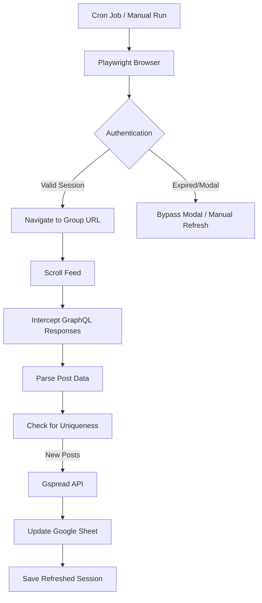

# 🚀 Facebook Group Scraper: Developer Guide

This guide provides instructions for setting up, configuring, and running the Facebook Scraper automations. The scraper uses Playwright to intercept GraphQL responses and syncs data to a Google Sheet.

---

## 🏗️ Architecture Overview

The following diagram illustrates how the scraper interacts with Facebook and Google Sheets:



---

## 🛠️ Prerequisites

- **Python 3.8+**
- **pip** (Python package manager)
- **Google Cloud Account** (for Sheets API)
- **VPS** (optional, for 24/7 automation)

---

## 🏗️ 1. Local Installation

1. **Clone the repository** (if applicable) and navigate to the directory:
   ```bash
   cd facebook-scraper
   ```

2. **Create and activate a virtual environment**:
   ```bash
   python3 -m venv venv
   source venv/bin/activate
   ```

3. **Install dependencies**:
   ```bash
   pip install -r requirements.txt
   ```

4. **Install Playwright Chromium**:
   ```bash
   playwright install chromium
   ```

---

## ⚙️ 2. Configuration (`.env`)

Create a `.env` file in the root directory with the following variables:

```env
GROUP_URL="https://www.facebook.com/groups/YOUR_GROUP_ID?sorting_setting=CHRONOLOGICAL"
SHEET_NAME="Your Google Sheet Name"
CREDENTIALS_FILE="credentials.json"
STORAGE_STATE="facebook_auth.json"
TIMEZONE_OFFSET=1
GROQ_API_KEY="your_optional_grok_key"
```

---

## 📊 3. Google Sheets Setup

The scraper uses a Service Account to interact with Google Sheets.

1.  Go to the [Google Cloud Console](https://console.cloud.google.com/).
2.  Create a new project.
3.  **Enable APIs**: Enable the **Google Sheets API** and **Google Drive API**.
4.  **Create Service Account**:
    - Go to **IAM & Admin > Service Accounts**.
    - Create a service account and name it (e.g., `fb-scraper-bot`).
    - Go to the **Keys** tab of the service account.
    - Click **Add Key > Create New Key > JSON**.
    - Download the JSON file and rename it to `credentials.json` in your project root.
5.  **Share the Sheet**:
    - Open your Google Sheet in the browser.
    - Click **Share**.
    - Add the service account's email address (found in `credentials.json`) as an **Editor**.

---

## 🔐 4. Facebook Authentication

Facebook's security often blocks simple username/password logins from VPS IPs. We use **Remote Debugging** to capture a valid session state (`facebook_auth.json`).

> [!IMPORTANT]
> This step MUST be performed whenever the session expires (usually once every few weeks).

### Step 1: Start the Remote Debugging Browser on the VPS
On the VPS, run:
```bash
./venv/bin/python start_remote_auth.py
```
*The script will launch a headless browser and wait for 3 minutes.*

### Step 2: Establish an SSH Tunnel from your Local Mac
On your local machine, run:
```bash
ssh -L 9222:127.0.0.1:9222 user@your_vps_ip
```

### Step 3: Log in via your Local Browser
1.  Open Chrome/Edge on your local machine.
2.  Navigate to `http://localhost:9222`.
3.  Click on the Facebook link and **manually log in**. Complete any 2FA or "Is this you?" checks.
4.  Once logged in and the feed is visible, wait for the VPS script timer to finish.
5.  The VPS will save the `facebook_auth.json` automatically.

---

## 🚀 5. Running the Scraper

### Manual Run (Local or VPS)
```bash
source venv/bin/activate
python scraper_playwright.py
```

### Remote VPS Deployment
Use the `deploy.sh` script to sync changes from your local machine to the VPS:
```bash
./deploy.sh
```

---

## ⏲️ 6. Automation (Cron Job)

To run the scraper automatically on the VPS (e.g., every 45 minutes), add a cron job:

1.  Open crontab: `crontab -e`
2.  Add the following line (replace paths as needed):
    ```cron
    */45 * * * * cd /home/houcem/facebook-scraper && ./venv/bin/python scraper_playwright.py >> /home/houcem/facebook-scraper/cron.log 2>&1
    ```

---

## 🔍 7. Troubleshooting & Verification

- **Logs**: Check `cron.log` on the VPS for the latest execution output.
- **Screenshots**: The scraper generates `vps_check.png` (latest view) and `vps_error.png` (on failure). Download these to see what the bot sees:
  ```bash
  scp user@your_vps_ip:~/facebook-scraper/vps_check.png ./
  ```
- **Modal Bypasses**: The script includes a "Continue as..." bypass. If Facebook changes its UI, update the regex in the `--- BYPASS PROFILE MODAL ---` section of `scraper_playwright.py`.

---

## 📁 File Structure

- `scraper_playwright.py`: Core logic for scraping and uploading.
- `start_remote_auth.py`: Helper for capturing Facebook session state.
- `deploy.sh`: Script for syncing files to the VPS.
- `check_sheet.py`: Utility to verify the Google Sheet current state.
- `facebook_auth.json`: Encrypted session cookies (Keep this private!).
- `credentials.json`: Google Service Account key (Keep this private!).
